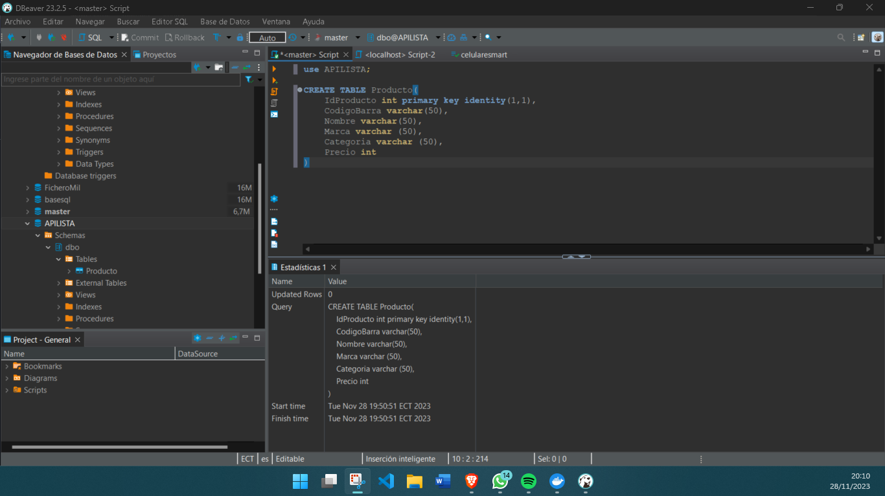
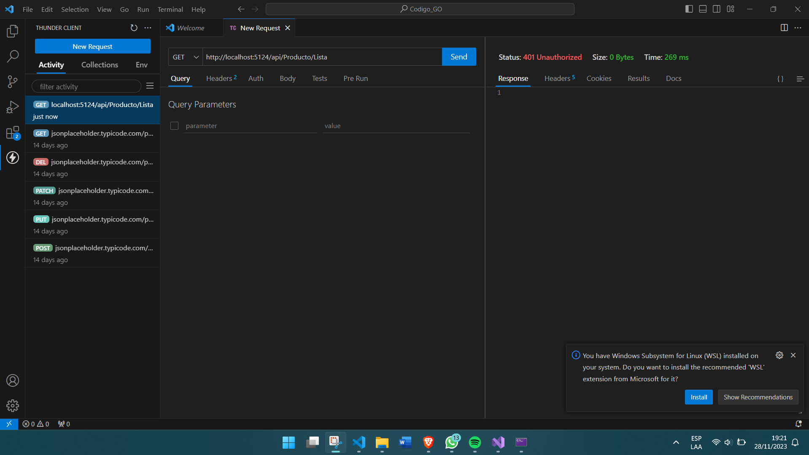
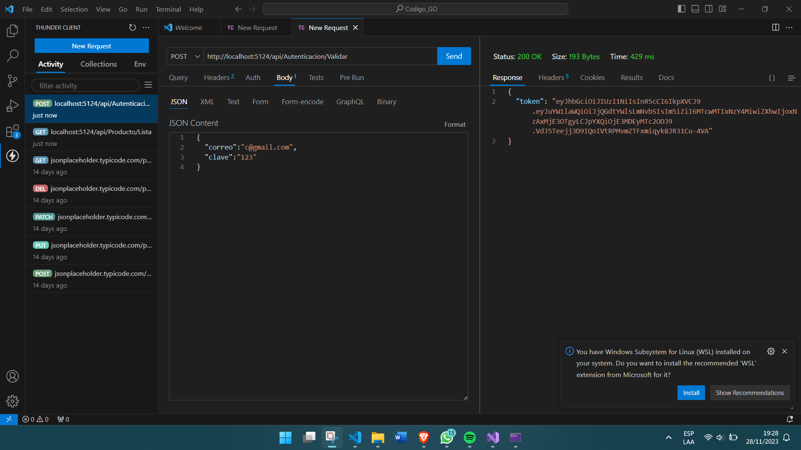
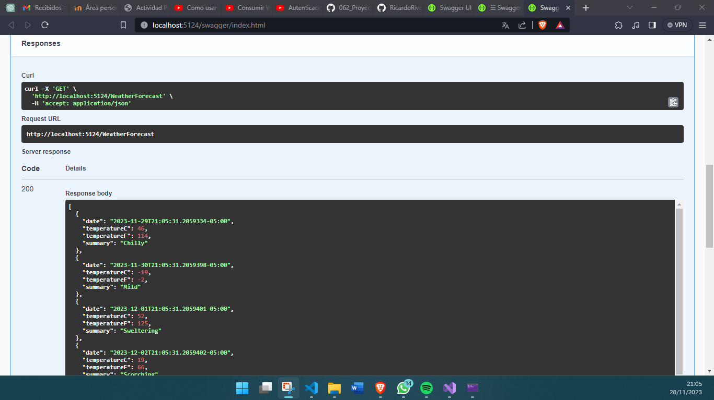

# DesarrolloAPI_ASPNet_R

## Descripción

Este proyecto utiliza una API RESTful creada con ASP.NET Core y basada en un tutorial del canal de YouTube Codigo Estudiante. La API está diseñada para gestionar productos almacenados en una base de datos de SQL Server que se encuentra en un contenedor Docker.


## Objetivo

El objetivo de este proyecto es desarrollar una API segura con ASP.NET Core, implementando autenticación con tokens JWT y utilizando middleware personalizado para mejorar la seguridad de la API.

### Uso de Thunder en Visual Studio Code

La extensión Thunder en Visual Studio Code facilita la realización de solicitudes HTTP a la API. Es especialmente útil para simular las solicitudes POST y GET necesarias para la autenticación y la obtención de datos.

## Uso de la API

### Conexión a la Base de Datos

### Se realizó una conexión con la base de datos de SQL Server a través de un contenedor Docker. Esto permite realizar operaciones CRUD en la tabla de productos desde la API.###

<br>

### Requisitos de Autenticación

- La API requiere autenticación mediante tokens JWT.
- Para acceder a los endpoints protegidos, se debe realizar una solicitud POST para obtener un token y luego incluirlo en el encabezado de la solicitud GET.

## Uso de la API

- Realizar una solicitud POST a `http://localhost:5124/api/Autenticacion/Validar` para obtener un token de acceso.
- Utilizar el token obtenido en la sección de autenticación de la solicitud GET a los endpoints protegidos.

### Ejemplo de solicitud POST para obtener token:

```http
{
  "correo": "c@gmail.com",
  "clave": "123"
}
```
## Configuración en appsettings.json
```json
{
  "ConnectionStrings": {
    "CadenaSQL": "Data Source=(local); Initial Catalog=PRUEBAS;Integrated Security=true"
  },
  "Logging": {
    "LogLevel": {
      "Default": "Information",
      "Microsoft.AspNetCore": "Warning"
    }
  },
  "AllowedHosts": "*",
  "settings": {
    "secretKey": "=Ricardox="
  }
}
```

### Seguridad y Autenticación

La seguridad en la API se ha implementado utilizando middleware y tokens JWT (JSON Web Tokens). Para acceder a los datos de productos a través de solicitudes GET.

1. Primero se debe solicitar un token de autenticación a través de una solicitud POST, ya que si se busca directo los datos con un GET, se emitirá un mensaje de **Status - 401: Unauthorized** .
  <br>
2. Para ello al realizar la petición Post, debemos de colocar la solicitud en el Json Content
  <br>
3. Una vez obtenido el token, se debe incluir en la cabecera de autorización de las solicitudes GET para obtener acceso a los datos protegidos.
## Requisitos de Autenticación

1. **Obtener un Token de Acceso:** Enviar una solicitud POST al endpoint de autenticación con las credenciales adecuadas para recibir un token de acceso.
2. **Incluir el Token en las Solicitudes GET:** Al realizar una solicitud GET para obtener la lista de productos, incluir el token obtenido en la cabecera de autorización de la solicitud para acceder a los datos protegidos.

Este proyecto implementa una API RESTful segura utilizando ASP.NET Core, aplicando prácticas avanzadas de autenticación y middleware.

## Configuración del Proyecto

- Crea un nuevo proyecto ASP.NET Core con el patrón de diseño MVC.
- Configura el middleware de autenticación para utilizar tokens JWT.

## Implementación de la API RESTful

- Desarrolla al menos dos controladores que gestionen operaciones CRUD en entidades específicas.
- Utiliza atributos como [Authorize] para asegurar que las operaciones requieran autenticación.

## Seguridad y Middleware

- Implementa middleware personalizado para registrar las solicitudes a la API antes y después del procesamiento.
- Explora la configuración de políticas de autorización para controlar el acceso a ciertos recursos.

## Documentación de la API

### Endpoints Disponibles

- **GET /api/producto/lista**: Obtiene la lista de productos.
- **GET /api/producto/obtener/{idProducto}**: Obtiene un producto por su ID.
- **POST /api/producto/guardar**: Guarda un nuevo producto.
- **PUT /api/producto/editar**: Edita un producto existente.
- **DELETE /api/producto/eliminar/{idProducto}**: Elimina un producto por su ID.

  <br>

##Elaborado por:
Ricardo Rivadeneria

## Recursos Adicionales

- [[Enlace al tutorial del canal de YouTube Codigo Estudiante](https://www.youtube.com/watch?v=3NJbzf-41f0)]
